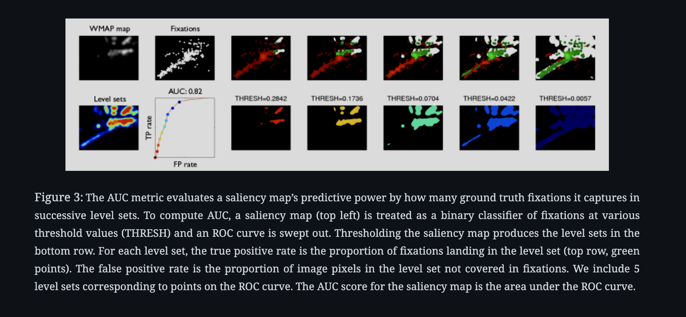

# Sailancy
Sailancy Maps

## Evaluation metrics

AUC-judd: Area Under the Curve (AUC) of the receiver operating characteristic (ROC) curve, which is generated by plotting the true positive rate (y-axis) against the false positive rate (x-axis) at various threshold settings. The AUC-judd is calculated by averaging the ROC scores obtained at each fixation point. The AUC-judd score is a measure of how well the saliency map separates fixated from non-fixated points. The AUC-judd score ranges from 0 to 1, where 1 indicates perfect performance and 0.5 indicates chance performance (https://ar5iv.labs.arxiv.org/html/1604.03605#S3.F3). "Takes really long...."



## Run sweep and train
For both variants, we ran the sweeps under config.yml.

Of course, one could also run:
```python

python train.py --batch_size=32 --device=cuda --dropout_rate=0.15018428136362405 --epochs=181 --log=True --log_steps=10 --lr=0.005448387537071393 --momentum=0.9893223997808792 --num_workers=10 --remote_path=True --seed=1 --val_steps=1
```
keep in mind that remote_path=True is for running on the clusters for the specific data path.

## Questions to answer in the report (maximum length 2 A4 pages)
- What existing work is the system based on? Provide a reference to a paper.
  - If you made modifications compared to the reference work, please provide a brief summary of them (a few sentences).
- Which loss function was used? What was the best loss value achieved on the validation data?
- How many epochs was the network trained for?
- Which hyperparameters were used (learning rate, dropout, data augmentation, other training procedures, . . . )? 
  - You may provide figures or graphs if you want.